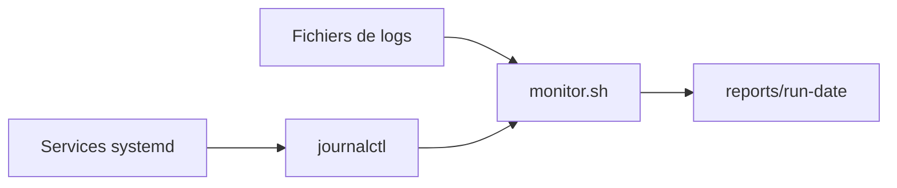

# Dossier Etudiant - TP Monitoring Shell (1h a 2h)

## Objectif du TP

Vous devez creer un script shell simple qui observe la machine de TP, extrait quelques informations utiles, puis ecrit un petit dossier de rapport.

Le but n'est pas de faire un outil parfait. Le but est de manipuler correctement :

- `systemctl` et `journalctl`
- `ps`, `top` ou `htop`
- `grep`, `awk`, `sed`
- `find`, `xargs`
- les pipes `|` et redirections `>`, `>>`, `2>&1`

## Contexte de la machine

Apres installation d'ubuntu lancez la commande `sudo LAB_DATA_LINES=400 LAB_METRICS_ROWS=300 LAB_TREE_FILES=600 ./install.sh`, la machine contient :

- Services : `fake-api`, `log-generator`, `noisy-workers`
- Logs principaux :
  - `/var/log/monitoring-lab/data/app.log`
  - `/var/log/monitoring-lab/data/metrics.csv`
  - `/var/log/monitoring-lab/tmp/tree/`

Verification rapide :

```bash
systemctl status fake-api log-generator noisy-workers
ls -lah /var/log/monitoring-lab/data/
```

## Travail demande

Creer le dossier de travail :

```bash
sudo mkdir -p /opt/monitoring-lab/votre-nom
sudo chown -R "$USER":"$USER" /opt/monitoring-lab/votre-nom
cd /opt/monitoring-lab/votre-nom
```

Creer un seul script :

```bash
monitor.sh
```

Votre script doit generer un dossier de rapport :

```bash
reports/run-YYYYmmdd-HHMMSS/
```

Exemple :

```bash
/opt/monitoring-lab/student/reports/run-20260514-143000/
```

## Ce que le script doit faire

### 1. Afficher le contexte d'execution

Le script doit afficher :

- l'heure de debut (`date`)
- le nom de la machine (`hostname`)
- l'utilisateur courant (`id -un`)

### 2. Creer le dossier de rapport

Le script doit :

- creer `reports/`
- creer un dossier `run-YYYYmmdd-HHMMSS`
- ecrire tous les fichiers de sortie dedans

### 3. Verifier les services

Pour chaque service :

- `fake-api`
- `log-generator`
- `noisy-workers`

Ecrire dans `services.txt` :

- le nom du service
- son etat avec `systemctl is-active`

Exemple attendu :

```text
fake-api active
log-generator active
noisy-workers active
```

### 4. Lire quelques logs systemd

Creer `journald.txt` avec :

```bash
journalctl -u fake-api -n 30 --no-pager
journalctl -u log-generator -n 30 --no-pager
```

Creer aussi `journald_errors.txt` avec uniquement les lignes contenant `ERROR` ou `CRITICAL`.

Indice :

```bash
grep -E "ERROR|CRITICAL"
```

### 5. Observer les processus

Creer :

- `top_cpu.txt` avec les 10 processus qui consomment le plus de CPU
- `hogs.txt` avec les processus contenant `cpu-hog.sh`

Commandes utiles :

```bash
ps aux --sort=-%cpu | head
ps aux | grep cpu-hog.sh
```

Partie manuelle a faire pendant le TP :

- lancer `top` ou `htop`
- reperer les processus `cpu-hog.sh`
- observer la colonne `NI` ou `nice`
- ne pas tuer de processus dans le script

### 6. Analyser `app.log`

Fichier :

```bash
/var/log/monitoring-lab/data/app.log
```

Creer `app_summary.txt` contenant :

- nombre total de lignes
- nombre de lignes `ERROR`
- nombre de lignes `CRITICAL`
- top 5 des hosts
- une version masquee des secrets dans `app_redacted.log`

Commandes attendues :

```bash
wc -l
grep -c
awk
sort
uniq -c
sed
```

### 7. Analyser `metrics.csv`

Fichier :

```bash
/var/log/monitoring-lab/data/metrics.csv
```

Creer `metrics_summary.txt` contenant :
log-generator
- nombre total de lignes
- nombre de lignes ou `cpu_pct >= 95`
- les 5 premieres lignes anormales

Indice : le fichier est separe par des virgules, donc utilisez `awk -F,`.

### 8. Utiliser `find` et `xargs`

Dans :

```bash
/var/log/monitoring-lab/tmp/tree/
```

Creer :

- `tree_bak.txt` : liste des fichiers `.bak`
- `tree_secret.txt` : fichiers contenant `SECRET=`

Contraintes :

- utiliser `find`
- utiliser `xargs`
- utiliser si possible `-print0` et `xargs -0`

## Fichiers attendus dans le rapport

A la fin, votre dossier `reports/run-.../` doit contenir au minimum :

- `services.txt`
- `journald.txt`
- `journald_errors.txt`
- `top_cpu.txt`
- `hogs.txt`
- `app_summary.txt`
- `app_redacted.log`
- `metrics_summary.txt`
- `tree_bak.txt`
- `tree_secret.txt`

## Bonus si vous avez le temps

Ces elements sont optionnels :

- creer un `REPORT.md` qui resume les fichiers generes
- creer un service systemd `student-monitor.service`
- creer un timer systemd `student-monitor.timer`
- ajouter un lien `reports/latest` vers le dernier run
- tester `kill` manuellement sur un processus `cpu-hog.sh`, puis observer le redemarrage par systemd

## Mini dossier d'architecture

Ajouter un fichier `archi/ARCHI.md` tres court avec :

- un schema Mermaid simple
- 5 a 10 lignes qui expliquent le parcours :
  - systemd/journald
  - fichiers logs
  - script
  - rapports

Exemple minimal :



## Checklist finale

- [ ] `bash -n monitor.sh` ne retourne pas d'erreur
- [ ] le script cree un dossier `reports/run-...`
- [ ] les fichiers attendus sont presents
- [ ] `journalctl` est utilise
- [ ] `grep`, `awk`, `sed`, `find`, `xargs` sont utilises
- [ ] vous savez expliquer chaque bloc du script
